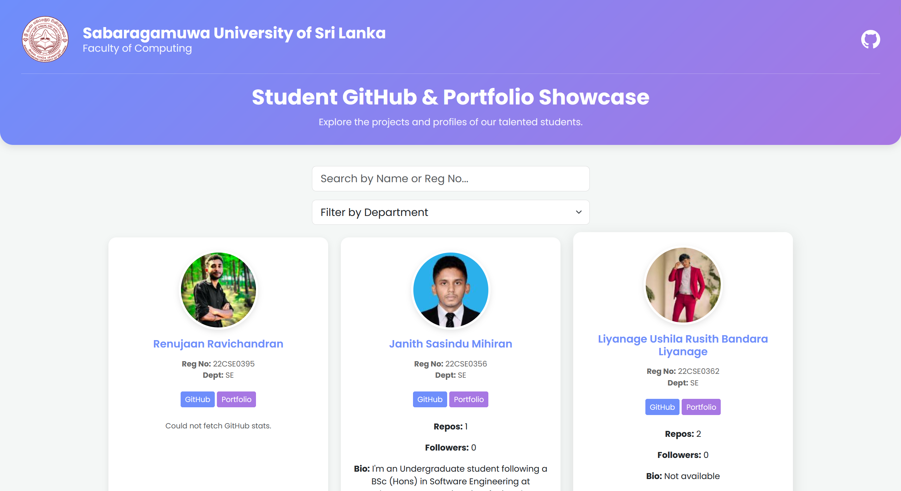

# SUSL Faculty of Computing - Student Showcase

<p align="center">
  
</p>

<h3 align="center">A platform to showcase the GitHub profiles and portfolios of the talented students from the Faculty of Computing, Sabaragamuwa University of Sri Lanka.</h3>

---

## 🌟 Introduction

This project is a web-based platform that allows students of the Faculty of Computing at Sabaragamuwa University of Sri Lanka to showcase their GitHub profiles and personal portfolios. It provides a centralized place for students, faculty, and potential employers to discover and explore the exciting projects and skills of our students.

## ✨ Features

*   **Student Profiles:** Each student has a dedicated card displaying their name, registration number, department, and links to their GitHub and portfolio.
*   **GitHub Stats:** Key statistics from each student's GitHub profile, such as public repositories, followers, and bio, are fetched and displayed.
*   **Search and Filter:** Users can easily search for students by name or registration number, and filter them by their department.
*   **Responsive Design:** The platform is designed to be fully responsive and accessible on all devices, from desktops to mobile phones.

## 📸 Screenshots



## 🚀 How to Use

1.  **Clone the repository:**
    ```bash
    git clone https://github.com/Nishan-Charlie/SUSL_2022_student_profiles.git
    ```
2.  **Open `index.html` in your browser:**
    *   Simply open the `index.html` file in your preferred web browser to view the application.

## 🛠️ Technologies Used

*   **Frontend:** HTML, CSS, JavaScript
*   **Frameworks/Libraries:** Bootstrap
*   **API:** GitHub API

## 🤝 Contributing

Contributions are welcome! If you have any ideas, suggestions, or bug reports, please open an issue or submit a pull request. To contribute:

1.  **Fork the repository.**
2.  **Create a new branch:** `git checkout -b my-new-feature`
3.  **Make your changes and commit them:** `git commit -am 'Add some feature'`
4.  **Push to the branch:** `git push origin my-new-feature`
5.  **Submit a pull request.**

For major changes, please open an issue first to discuss what you would like to change.

## 📝 License

This project is licensed under the MIT License - see the [LICENSE](LICENSE) file for details.